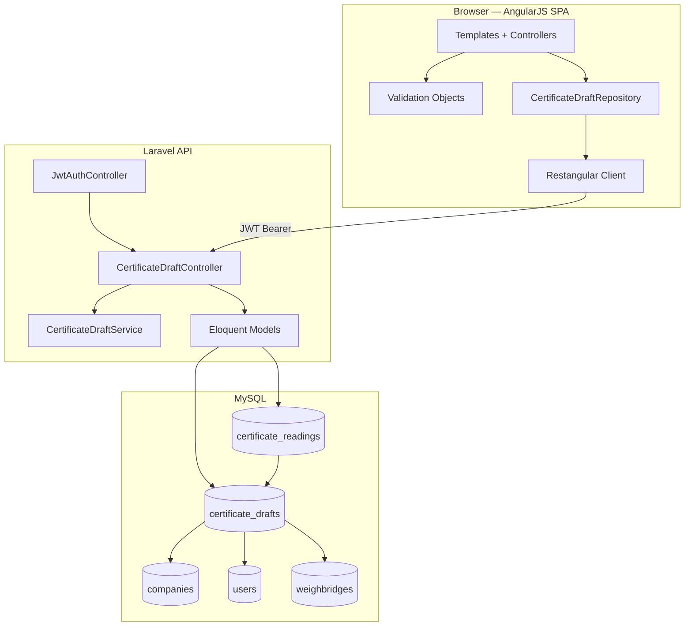
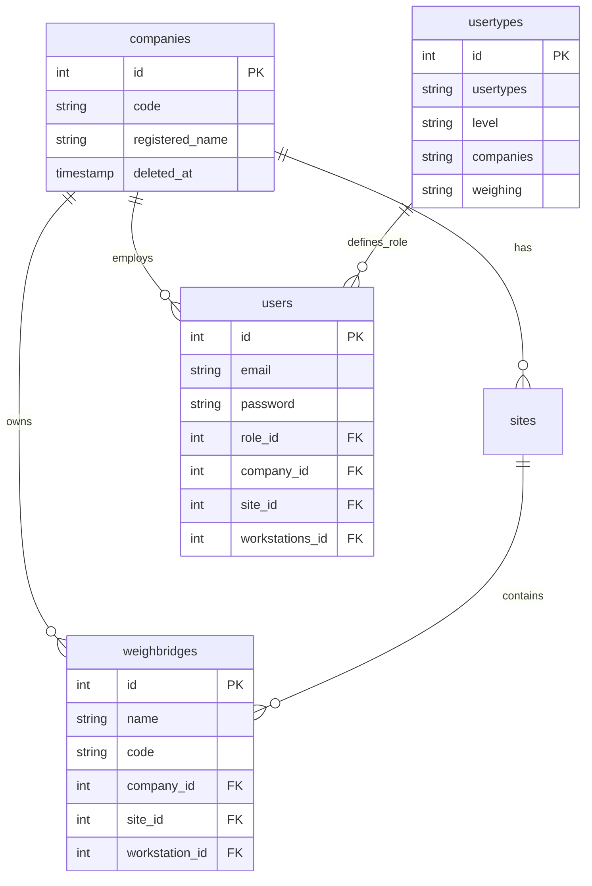
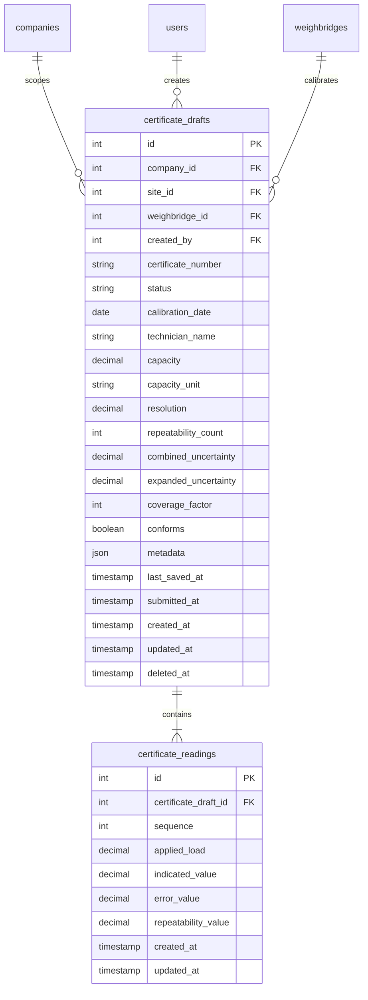
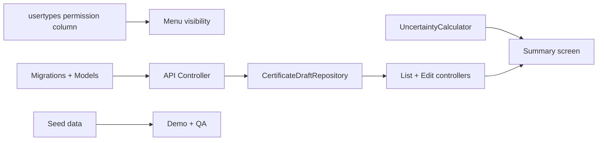

# Weighsoft — Architecture Plan

**Scope:** Existing system architecture + Certificate Drafts extension  
**Document version:** 1.0  
**Last updated:** June 2026

---

## 1. Executive Summary

Weighsoft is a three-tier weighbridge management application:

| Tier | Technology | Location |
|------|------------|----------|
| Frontend SPA | AngularJS 1.4.8, Bootstrap 4, UI Router, Restangular | `Weighsoft.v1/Weighsoft.ui.v1/` |
| Backend API | Laravel 8, PHP 8.3, JWT auth, Eloquent ORM | `Weighsoft.v1/Weighsoft.back.v1/` |
| Database | MySQL with soft deletes, INT PKs for master data | Shared via Laravel migrations |

The Certificate Drafts feature extends this stack without introducing new frameworks. It adds two MySQL tables, one API resource, one AngularJS module, and shared calculation helpers — following the established Pallet/Contract module shape.

---

## 2. High-Level System Diagram



---

## 3. Existing Architecture Patterns (Must Follow)

### 3.1 Backend

```
Request → api middleware (JWT) → JwtAuthController → Eloquent Model → JSON Response
```

- All authenticated endpoints extend `JwtAuthController` (provides `$this->user`).
- Routes registered as `Route::resource()` in `routes/api.php`.
- Validation via `Illuminate\Support\Facades\Validator`.
- Company scoping: filter by `$this->user->company_id` unless `role_id` is admin (1 or 2) — pattern from `CompanyController::index()`.
- Soft deletes on master data tables (`deleted_at`).

**Key files:**

| File | Role |
|------|------|
| `app/Http/Controllers/JwtAuthController.php` | Auth base class |
| `app/Http/Controllers/PalletController.php` | CRUD template |
| `routes/api.php` | Route registration |
| `app/Models/Pallet.php` | Eloquent model template |

### 3.2 Frontend

```
UI Router state → Controller as System → Restangular → $rootScope.Start/Loaded/Error
```

- Controllers use `controller as System` syntax (`var vm = this`).
- API calls **always** use Restangular (never `$http` directly for domain data).
- Loading overlay: `$rootScope.Start()` before async, `$rootScope.Loaded()` on success.
- Errors: `$rootScope.Error(response)` — handles JWT expiry redirect.
- Nested modules: parent state (`app.pallets`) + child states (`.list`, `.edit`).
- Lookup caching: `$Functions` factory wraps Restangular `getList()` with `$q` promises.
- Sidebar menu: `$menuItems.prepareSidebarMenu(permissions)` checks `usertypes` string flags.

**Key files:**

| File | Role |
|------|------|
| `app/js/routes.js` | UI Router state definitions |
| `app/js/app.js` | `$rootScope.Start/Loaded/Error` |
| `app/js/factory.js` | `$Functions` lookup factory |
| `app/js/services.js` | `$menuItems` permission-driven menu |
| `app/js/controllers/pallet/` | Module pattern to copy |

---

## 4. Entity Relationship Model

### 4.1 Existing Entities (Relevant Subset)



**Membership model:** Weighsoft does not have a separate `memberships` table. A user's membership in a company is represented by `users.company_id`, with optional `site_id` and `workstations_id` narrowing scope. Permissions come from `users.role_id` → `usertypes`.

### 4.2 New Entities (Certificate Drafts)



### 4.3 Status Lifecycle

```
draft → in_review → submitted
                  ↘ cancelled
```

| Status | Meaning | Who can set |
|--------|---------|-------------|
| `draft` | Work in progress, auto-saved | Any user with `certificate_drafts` permission |
| `in_review` | Calculations complete, pending approval | Creator or admin |
| `submitted` | Finalised certificate draft | Admin only (`role_id` 1 or 2, or `certificate_drafts_admin`) |
| `cancelled` | Discarded | Admin only |

---

## 5. Certificate Drafts Module Architecture

### 5.1 Backend Layer Diagram

```
routes/api.php
    └── CertificateDraftController (extends JwtAuthController)
            ├── index()      — list by company_id (+ optional site_id, status)
            ├── store()      — create draft with initial status 'draft'
            ├── show($id)    — single draft + readings eager-loaded
            ├── update($id)  — full update / auto-save
            ├── destroy($id) — soft delete
            └── submit($id)  — POST custom action: draft → submitted
        CertificateDraftService
            ├── calculateError(reading)
            ├── calculateRepeatability(readings[])
            ├── calculateCombinedUncertainty(readings[], resolution)
            └── calculateExpandedUncertainty(u_c, k)
        CertificateDraft (Model)
        CertificateReading (Model)
```

### 5.2 Frontend Layer Diagram

```
routes.js
    app.certificate-drafts          → CertificateDraftsCtrl (shell, company/site picker)
    app.certificate-drafts.list     → CertificateDraftListCtrl
    app.certificate-drafts.edit     → CertificateDraftEditCtrl (wizard)

CertificateDraftRepository (factory)
    list(params) / get(id) / create(data) / update(id, data) / remove(id) / autosave(id, data)

certificateDraft.schema.js
    validateStep1(draft) / validateStep2(readings) / validateFull(draft)

uncertaintyCalculator.js
    computeSummary(readings, resolution, coverageFactor)

Directives
    certificateStatusBadge — reusable status pill
    formSection — reusable fieldset wrapper
```

### 5.3 UI Router States (Proposed)

| State | URL | Controller | Template |
|-------|-----|------------|----------|
| `app.certificate-drafts` | `/certificate-drafts` | `CertificateDraftsCtrl as System` | `certificate-drafts/shell.html` |
| `app.certificate-drafts.list` | `/list/:id` | `CertificateDraftListCtrl as System` | `certificate-drafts/list.html` |
| `app.certificate-drafts.edit` | `/edit/:draft_id` | `CertificateDraftEditCtrl as System` | `certificate-drafts/edit.html` |

Mirrors `app.pallets` / `app.pallets.list` / `app.pallets.edit` from `routes.js`.

### 5.4 API Contract

Base path: `/api/certificate-drafts` (JWT required)

| Method | Path | Action |
|--------|------|--------|
| GET | `/api/certificate-drafts?company_id=&site_id=&status=` | List drafts |
| POST | `/api/certificate-drafts` | Create draft |
| GET | `/api/certificate-drafts/{id}` | Get draft + readings |
| PUT | `/api/certificate-drafts/{id}` | Update / auto-save |
| DELETE | `/api/certificate-drafts/{id}` | Soft delete |
| POST | `/api/certificate-drafts/{id}/submit` | Submit draft (admin) |

Response shape (single draft):

```json
{
  "id": 1,
  "company_id": 1,
  "site_id": 2,
  "weighbridge_id": 5,
  "certificate_number": "CAL-2026-001",
  "status": "draft",
  "calibration_date": "2026-06-05",
  "technician_name": "V. Julius",
  "capacity": 60000,
  "capacity_unit": "kg",
  "resolution": 20,
  "combined_uncertainty": 15.2,
  "expanded_uncertainty": 30.4,
  "coverage_factor": 2,
  "conforms": true,
  "last_saved_at": "2026-06-05T14:30:00Z",
  "readings": [
    {
      "id": 1,
      "sequence": 1,
      "applied_load": 10000,
      "indicated_value": 10020,
      "error_value": 20,
      "repeatability_value": 10
    }
  ]
}
```

---

## 6. Security and Multi-Tenancy

| Concern | Implementation |
|---------|----------------|
| Authentication | JWT via `auth:api` middleware (existing) |
| Authorisation | New `certificate_drafts` permission on `usertypes`; submit/delete requires admin role |
| Data isolation | `CertificateDraftController::index()` filters by `company_id` from `$this->user` |
| Input validation | Server-side `Validator::make()` + client-side schema objects |
| Soft delete | `deleted_at` on `certificate_drafts`; readings cascade-soft-delete or orphan-block |

---

## 7. Future PouchDB Sync Architecture (Documented, Not Built)

When offline sync is needed, the MySQL schema maps directly to PouchDB documents:

```
certificate_draft:{id}     → draft header fields + _rev
certificate_reading:{id}   → reading fields + draft_id reference
```

Sync direction: PouchDB ↔ Laravel API using `_rev` conflict detection. The Laravel/MySQL implementation is the source of truth during this placement.

---

## 8. Company Admin Improvement (Task 6 — Architectural Note)

The Company Admin improvement runs in parallel and touches existing entities only:

| Improvement | Architecture impact |
|-------------|---------------------|
| Certificate settings per company | Add optional `certificate_prefix` column to `companies` |
| Admin dashboard card | New panel on `app.dashboard-main` showing draft counts via `GET /api/certificate-drafts?status=draft` |
| User membership visibility | Enhance `users/list.html` to show company/site assignment clearly |

No new top-level module required — extends `CompaniesCtrl` and dashboard controller.

---

## 9. Testing Architecture

| Layer | Tool | Location |
|-------|------|----------|
| Backend unit | PHPUnit | `tests/Unit/CertificateDraftServiceTest.php` |
| Backend feature | PHPUnit | `tests/Feature/CertificateDraftControllerTest.php` |
| Calculation fixtures | JSON + data provider | `tests/fixtures/certificateCalculations.json` |
| Frontend validation | Manual QA + optional Karma | `docs/07-qa-testing/CERTIFICATE-DRAFTS-QA.md` |

---

## 10. File Map (New Files)

### Backend (`Weighsoft.back.v1/`)

```
database/migrations/xxxx_create_certificate_drafts_table.php
database/migrations/xxxx_create_certificate_readings_table.php
database/seeders/CertificateDraftSeeder.php
app/Models/CertificateDraft.php
app/Models/CertificateReading.php
app/Http/Controllers/CertificateDraftController.php
app/Services/CertificateDraftService.php
tests/Unit/CertificateDraftServiceTest.php
tests/Feature/CertificateDraftControllerTest.php
tests/fixtures/certificateCalculations.json
```

### Frontend (`Weighsoft.ui.v1/`)

```
app/js/controllers/certificate-drafts/shell.controller.js
app/js/controllers/certificate-drafts/list.controller.js
app/js/controllers/certificate-drafts/edit.controller.js
app/js/repositories/CertificateDraftRepository.js
app/js/validation/certificateDraft.schema.js
app/js/helpers/uncertaintyCalculator.js
app/js/helpers/numericValidation.js
app/js/directives/certificateStatusBadge.directive.js
app/js/directives/formSection.directive.js
app/tpls/certificate-drafts/shell.html
app/tpls/certificate-drafts/list.html
app/tpls/certificate-drafts/edit.html
app/tpls/certificate-drafts/_step_header.html
app/tpls/certificate-drafts/_step_readings.html
app/tpls/certificate-drafts/_step_calculations.html
app/tpls/certificate-drafts/_step_review.html
```

### Modified existing files

```
routes/api.php                          — add resource route + submit action
database/seeders/DatabaseSeeder.php     — call CertificateDraftSeeder
app/js/routes.js                        — add certificate-drafts states
app/js/services.js                      — menu item + permission check
app/js/factory.js                       — $Functions.CertificateDrafts()
database/migrations (usertypes)          — add certificate_drafts permission column
```

---

## 11. Approach Comparison (Task 38)

| Approach | Pros | Cons | Recommendation |
|----------|------|------|----------------|
| **A — MySQL-first (chosen)** | Matches entire Weighsoft stack; simple CRUD; easy JWT auth; mentor can query DB | No offline support | **Use for placement** |
| **B — PouchDB-first** | Offline-capable; curriculum-aligned doc schema | No existing PouchDB infra; sync complexity; diverges from codebase | Document schema only; defer implementation |

**Decision:** Implement Approach A. Document PouchDB schema in spec for future sync phase.

---

## 12. Dependencies



Critical path: migrations → API → repository → UI → calculations → QA.
