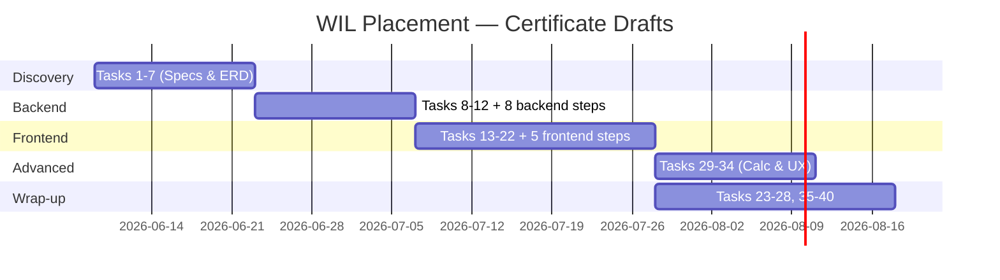

# Weighsoft WIL Placement — Project Plan

**Student:** Victoria Julius  
**Host system:** Weighsoft v1 (Laravel 8 + AngularJS 1.4.8)  
**Capstone feature:** Certificate Drafts  
**Document version:** 1.0  
**Last updated:** June 2026

---

## 1. Purpose

This plan maps all 40 WIL placement tasks to concrete work on the Weighsoft codebase. It is the master schedule for discovery, design, implementation, testing, and reflection — without repeating environment setup steps (those are handled separately).

The primary deliverable is a **Certificate Drafts** module that lets calibration technicians create, auto-save, calculate, and submit weighbridge calibration certificate drafts within the existing multi-company Weighsoft application.

---

## 2. System Context (Plain English)

Weighsoft is a weighbridge management system used at industrial sites. Operators weigh trucks, record transactions, print tickets, and run reports. The system is organised as:

```
Company → Site → Workstation → Weighbridge
```

Users belong to a company (and optionally a site/workstation) and receive permissions through a **User Type** (role). The AngularJS frontend talks to a Laravel REST API over JWT authentication. All data access uses **Restangular**; loading and errors use `$rootScope.Start()`, `$rootScope.Loaded()`, and `$rootScope.Error()`.

**Gap today:** There is no calibration certificate workflow. Weighbridges are configured, but certificate records, calibration readings, and uncertainty calculations do not exist. This placement introduces that capability as Certificate Drafts.

---

## 3. Adaptation Rules (Curriculum → Codebase)

| Curriculum term | Weighsoft implementation |
|-----------------|--------------------------|
| React Native / React Hook Form | AngularJS templates with `ng-model` and `ng-submit` |
| TanStack Query | Restangular (`getList`, `one().get()`, `post`, `customPUT`, `remove`) |
| PouchDB | Document schema designed for future sync; **implemented in Laravel/MySQL now** |
| Zod schemas | JavaScript validation objects (documented in Zod-style structure) |
| FlatList | `ng-repeat` inside Bootstrap/DataTables tables |
| Repository class | AngularJS factory (`CertificateDraftRepository`) + optional Laravel service |

---

## 4. Reference Modules (Copy These Patterns)

| Pattern | Backend reference | Frontend reference |
|---------|-------------------|-------------------|
| CRUD resource API | `PalletController.php` | `pallet/edit.controller.js`, `pallet/list.controller.js` |
| Company-scoped listing | `CompanyController.php` (`company_id` filter) | `companies.js` (`CompaniesCtrl as System`) |
| Nested UI Router module | — | `app.pallets` → `app.pallets.list` → `app.pallets.edit` |
| Lookup data factory | — | `$Functions` factory in `factory.js` |
| Role-based menu | — | `$menuItems.prepareSidebarMenu(permissions)` in `services.js` |
| Form validation | `Validator::make()` in controllers | Inline checks + shared validation objects |
| Loading / errors | `JwtAuthController::error()` | `$rootScope.Start()` / `Loaded()` / `Error()` |

---

## 5. Work Phases and Task Mapping

### Phase A — Discovery and Requirements (Weeks 1–2)

| Task | Deliverable | Codebase touchpoints |
|------|-------------|----------------------|
| **1** System overview | `docs/01-system-overview.md` (derived from this plan §2) | Read `Weighsoft.back.v1/docs/01-getting-started/`, `Weighsoft.ui.v1/docs/00-FRONTEND-ARCHITECTURE.md` |
| **2** Onboarding notes | `docs/02-onboarding-notes.md` | Repo structure under `Weighsoft.v1/`; note AngularJS stack (not Expo) |
| **3** Existing feature journey | `docs/03-user-journey-pallets.md` | Trace `app.pallets` states, `PalletController`, templates in `app/tpls/pallet/` |
| **4** Mentor interview | `docs/04-mentor-interview-notes.md` | Questions about calibration workflow, certificate fields, approval process |
| **5** Certificate Drafts spec | `docs/05-certificate-drafts-spec.md` | **This document set — primary spec** |
| **6** Company Admin improvement spec | `docs/06-company-admin-improvement.md` | `CompaniesCtrl`, `companies/list.html`, `CompanyController` |
| **7** Entity relationship model | ERD in `docs/00-architecture-plan.md` §4 | `companies`, `users`, `usertypes`, new `certificate_drafts`, `certificate_readings` |

**Exit criteria:** Specs approved by mentor; ERD agreed; no code changes required yet.

---

### Phase B — Data Layer (Weeks 3–4)

| Task | Deliverable | Implementation |
|------|-------------|----------------|
| **8** PouchDB document schema | Section in `05-certificate-drafts-spec.md` §6 | Future-facing; maps 1:1 to MySQL tables |
| **9** Zod-style validation objects | `app/js/validation/certificateDraft.schema.js` | Required fields, reading ranges, step completeness |
| **10** Repository class | `app/js/repositories/CertificateDraftRepository.js` | Wraps Restangular CRUD for `certificate-drafts` |
| **11** CRUD on repository | Extend repository with `list`, `get`, `create`, `update`, `delete`, `autosave` | Mirror `PalletController` endpoints |
| **12** Seed data | `database/seeders/CertificateDraftSeeder.php` | Demo company, admin user, 2–3 draft certificates with readings |

**Backend implementation steps (8 tasks):**

1. Create `certificate_drafts` migration  
2. Create `certificate_readings` migration  
3. Create Eloquent models (`CertificateDraft`, `CertificateReading`)  
4. Create `CertificateDraftController` extending `JwtAuthController`  
5. Register `Route::resource('certificate-drafts', ...)` in `routes/api.php`  
6. Add `CertificateDraftService` for uncertainty calculations  
7. Create `CertificateDraftSeeder` and register in `DatabaseSeeder`  
8. Add PHPUnit tests for service + controller validation  

**Exit criteria:** API returns seeded drafts filtered by `company_id`; migrations run cleanly.

---

### Phase C — Frontend Module (Weeks 5–7)

| Task | Deliverable | Implementation |
|------|-------------|----------------|
| **13** Screen wireframe | `docs/wireframes/certificate-drafts-wizard.md` | 4-step wizard: Header → Readings → Calculations → Review |
| **14** Form with validation | `certificate-drafts/edit.controller.js` + `edit.html` | `ng-model` bindings, schema validation on submit |
| **15** Validation messages | Template `ng-show` blocks + `$rootScope.Message()` | Required fields, numeric ranges, min readings count |
| **16** List screen | `list.controller.js` + `list.html` | `ng-repeat` table, empty/loading/error states |
| **17** Restangular data loading | List + edit controllers | `$rootScope.Start()` before calls, `Loaded()` on success |
| **18** Optimistic updates | Edit flow: update `vm.draftList` before server confirms | Roll back via `$rootScope.Error()` on failure |
| **19** Navigation route | `app.certificate-drafts` parent + `.list` + `.edit` states | Follow `app.pallets` nested state pattern in `routes.js` |
| **20** Role-based UI | `ng-if` on admin actions; menu entry gated by new permission | Add `certificate_drafts` column to `usertypes` |
| **21** Reusable component | `StatusBadge` directive or `FormSection` directive | Draft status: `draft`, `in_review`, `submitted` |
| **22** Shared utility refactor | Extract repeated numeric validation to `app/js/helpers/numericValidation.js` | Used by certificate + existing weighing patterns |

**Frontend implementation steps (5 tasks):**

1. Add UI Router states and lazy-load deps in `routes.js`  
2. Create list controller, template, and parent shell controller  
3. Create edit/wizard controller and step templates  
4. Add `CertificateDraftRepository`, validation schema, and `$Functions.CertificateDrafts()`  
5. Register sidebar menu item and `usertypes` permission check  

**Exit criteria:** Full create → auto-save → calculate → submit flow works in browser against local API.

---

### Phase D — Calculations and Advanced UX (Weeks 8–9)

| Task | Deliverable | Implementation |
|------|-------------|----------------|
| **29** Auto-save | Debounced `customPUT` every 30s + on step change | Store `last_saved_at` on draft |
| **30** Progress indicators | Bootstrap progress bar across wizard steps | `vm.currentStep` / `vm.totalSteps` |
| **31** Uncertainty helper | `app/js/helpers/uncertaintyCalculator.js` + backend `CertificateDraftService` | Combined standard uncertainty from repeatability + resolution |
| **32** Calculation fixtures | `tests/fixtures/certificateCalculations.json` + PHPUnit data provider | Known inputs → expected `u_c`, `U`, conformity flag |
| **33** Results summary screen | Wizard step 4 template | Table of readings, mean, std dev, expanded uncertainty |
| **34** DB error surfacing | Controller try/catch → `$rootScope.Error(response)` | 422 validation, 404 not found, 500 server errors |

**Exit criteria:** Calculations match mentor-supplied formulas; auto-save recovers after page refresh.

---

### Phase E — Quality, Documentation, and Process (Ongoing + Week 10)

| Task | Deliverable | When |
|------|-------------|------|
| **23** Unit tests — utility | `tests/Unit/UncertaintyCalculatorTest.php` or Karma test for JS helper | Phase D |
| **24** Unit tests — schema | Test validation object rejects bad readings | Phase B |
| **25** Debug known issue | `docs/09-issues/certificate-drafts-[issue].md` | As encountered (e.g. company scope filter) |
| **26** PR review comments | Comment on a teammate/staff PR in repo | Week 8+ |
| **27** Feature technical docs | `docs/06-features/CERTIFICATE-DRAFTS.md` | After Phase D |
| **28** QA checklist | `docs/07-qa-testing/CERTIFICATE-DRAFTS-QA.md` | Before demo |
| **35** Privacy checklist | `docs/08-project-management/PRIVACY-CHECKLIST.md` | Week 2 and Week 10 |
| **36** Daily logbook | `docs/logbook/YYYY-MM-DD.md` | Daily |
| **37** Demo script | `docs/07-qa-testing/CERTIFICATE-DRAFTS-DEMO.md` | Week 10 |
| **38** Approach comparison | Section in spec or `docs/04-developer-guide/CERTIFICATE-DRAFTS-APPROACHES.md` | MySQL-now vs PouchDB-first |
| **39** Mini backlog | `docs/09-issues/certificate-drafts-backlog.md` | After QA |
| **40** End-of-placement reflection | `docs/10-reflection/end-of-placement.md` | Final week |

---

## 6. Milestone Timeline



| Milestone | Target | Evidence |
|-----------|--------|----------|
| M1 — Plans approved | End Week 2 | This doc + spec + architecture plan signed off |
| M2 — API complete | End Week 4 | Postman/curl CRUD on `/api/certificate-drafts` |
| M3 — UI module live | End Week 7 | Login → list → create → save draft |
| M4 — Calculations verified | End Week 9 | Fixtures pass; summary screen correct |
| M5 — Demo ready | End Week 10 | QA checklist green; demo script rehearsed |

---

## 7. Risk Register

| Risk | Impact | Mitigation |
|------|--------|------------|
| No existing certificate domain code | High — greenfield feature | Follow Pallet/Contract module patterns exactly |
| `memberships` table does not exist | Medium — curriculum assumes it | Model membership as `users.company_id` + `usertypes` permissions |
| Uncertainty formula ambiguity | High — wrong calculations | Task 4 mentor interview; fixture tests (Task 32) |
| AngularJS 1.x learning curve | Medium | Pair with `CompaniesCtrl` and `PalletEditCtrl` as templates |
| Company data isolation | High — data leak across tenants | Filter all queries by `$this->user->company_id` (see `CompanyController`) |
| Empty `DatabaseSeeder` today | Low | Task 12 creates first meaningful seed data |

---

## 8. Success Criteria

1. A technician can log in, open Certificate Drafts, and see only their company's drafts.  
2. A new draft auto-saves and survives a browser refresh.  
3. At least three calibration readings per draft are validated and stored.  
4. Uncertainty results display on the summary step and match fixture expectations.  
5. An admin can submit a draft; a non-admin cannot see submit/delete actions.  
6. All 40 tasks have a traceable artifact (file, PR, or logbook entry).  

---

## 9. Document Index

| Document | Path |
|----------|------|
| Project plan (this file) | `docs/00-project-plan.md` |
| Architecture plan | `docs/00-architecture-plan.md` |
| Certificate Drafts spec | `docs/05-certificate-drafts-spec.md` |
| System overview (Task 1) | `docs/01-system-overview.md` |
| Onboarding notes (Task 2) | `docs/02-onboarding-notes.md` |
| User journey (Task 3) | `docs/03-user-journey-pallets.md` |
| Mentor interview (Task 4) | `docs/04-mentor-interview-notes.md` |
| Company Admin spec (Task 6) | `docs/06-company-admin-improvement.md` |

---

## 10. Next Actions (Post-Plan Approval)

1. Review and approve these three planning documents with mentor.  
2. Complete Task 4 mentor interview; update spec §3 with confirmed field list.  
3. Execute backend implementation steps 1–8 (Phase B).  
4. Execute frontend implementation steps 1–5 (Phase C).  
5. Create demo user via Laravel Tinker and verify login → Certificate Drafts menu visibility.  

*Setup and environment commands are documented separately and are intentionally excluded from this plan.*
