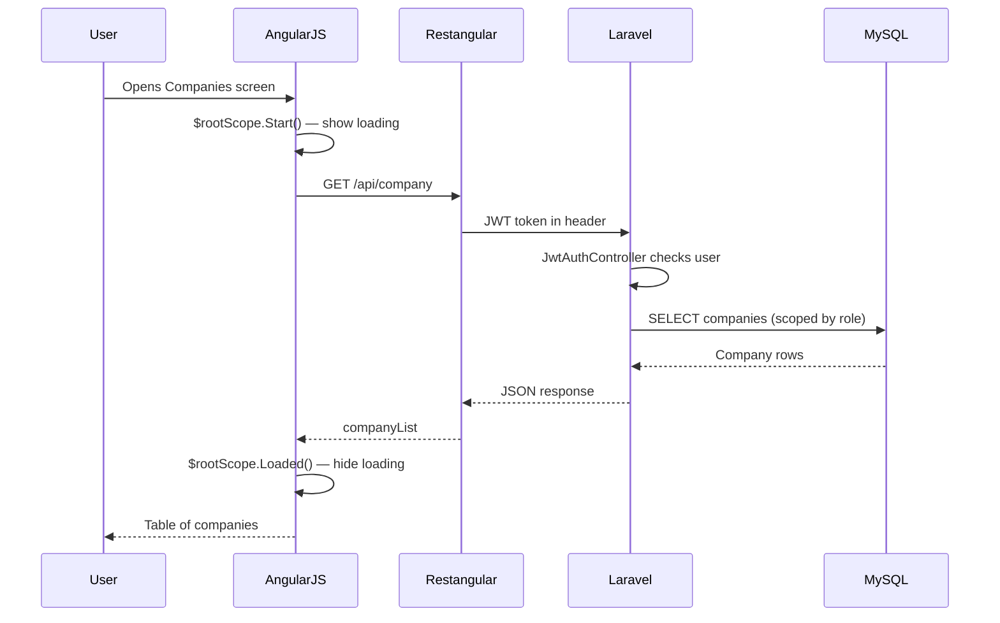

# Weighsoft System Overview

**Task 1 deliverable**  
**Audience:** WIL placement — plain-English introduction  
**Last updated:** June 2026

---

## What is Weighsoft?

Weighsoft is a **weighbridge management system**. It is used at industrial sites where trucks and other vehicles are weighed on large scales (weighbridges). The system records weights, calculates net loads, prints tickets, manages customers and products, and produces reports.

Typical use cases:

- **Receiving goods** — a truck arrives full, unloads, leaves empty; the system calculates net weight delivered.
- **Dispatching goods** — a truck arrives empty, loads, leaves full; the system calculates net weight dispatched.
- **Single weighing** — one weight captured and a ticket printed immediately.

---

## How the system is organised

Weighsoft uses a hierarchy. Think of it as nested levels of a business:

```
Company          (the organisation, e.g. "ABC Grain Ltd")
  └── Site       (a physical location with weighbridges)
        └── Workstation   (an operator terminal)
              └── Weighbridge   (the physical scale)
```

| Level | Plain English | Example |
|-------|---------------|---------|
| Company | The business using the system | Demo Grain Co |
| Site | A depot or silo with scales | Johannesburg Depot |
| Workstation | The PC/terminal where an operator works | Inbound Desk 1 |
| Weighbridge | The actual scale hardware | WB-01 |

Every weighing transaction is tied to a company, site, and workstation so data stays organised and reportable.

---

## Who uses it?

Users log in with email and password. Each user has:

- A **company** they belong to (`users.company_id`)
- Optionally a **site** and **workstation** they work at
- A **User Type** (role) that controls what menus and actions they can see

Common roles:

| Role | What they do |
|------|--------------|
| System administrator | Full setup — companies, sites, users, weighbridges |
| Site manager | Runs a site, manages operators, views reports |
| Weighbridge operator | Performs day-to-day weighing only |
| Verifier / supervisor | Reviews and approves transactions that need checking |

Permissions are stored as `"true"` / `"false"` flags on the `usertypes` table (e.g. `weighing`, `companies`, `users`).

---

## The three parts of the system

### 1. Frontend — what users see

- **Technology:** AngularJS 1.4.8 single-page application (SPA)
- **Location:** `Weighsoft.v1/Weighsoft.ui.v1/`
- **Looks like:** A web dashboard with a sidebar menu, forms, and data tables
- **Talks to:** The Laravel API using **Restangular** (never raw `$http`)

Key folders:

| Folder | Purpose |
|--------|---------|
| `app/js/controllers/` | Screen logic (`controller as System`) |
| `app/js/routes.js` | Page navigation (UI Router states) |
| `app/tpls/` | HTML templates |
| `app/js/factory.js` | Shared lookup data (`$Functions`) |

### 2. Backend — the API and business rules

- **Technology:** Laravel 8, PHP 8.3, JWT authentication
- **Location:** `Weighsoft.v1/Weighsoft.back.v1/`
- **Does:** Stores data in MySQL, validates input, enforces company scoping

Key folders:

| Folder | Purpose |
|--------|---------|
| `app/Http/Controllers/` | API endpoints (extend `JwtAuthController`) |
| `app/Models/` | Database table mappings (Eloquent) |
| `routes/api.php` | API route definitions |
| `database/migrations/` | Database structure |

### 3. Database — where data lives

- **Technology:** MySQL
- **Pattern:** Most master data uses integer IDs; some transaction tables use UUIDs
- **Safety:** Soft deletes (`deleted_at`) on many tables — records are hidden, not destroyed

---

## How a request flows (example: list companies)



If something fails, `$rootScope.Error(response)` shows a toast message. If the JWT token is invalid, the user is logged out.

---

## Main features today

| Area | What it does |
|------|--------------|
| **Setup** | Companies, sites, workstations, weighbridges, cameras, weigh types |
| **Weighing** | First weight, second weight, verify, reprint tickets |
| **Operations** | Contracts, pallets, stored tares |
| **Master data** | Business partners, products, hauliers, RFID vehicles |
| **Reports** | Transaction history, exceptions, reporting centre |
| **Integrations** | Xero invoicing, ESP32 boom/light control, cameras, AS/400 export |

---

## What is missing (why Certificate Drafts?)

Weighbridges are **configured** in the system (name, scale port, decimal places), but there is no module for:

- Recording **calibration test readings**
- Calculating **measurement uncertainty**
- Managing **certificate drafts** before they are finalised

The WIL placement adds this as the **Certificate Drafts** feature, following the same patterns as existing modules like Pallets and Contracts.

---

## Placement repo vs Weighsoft source repos

Your GitHub repo (`VJ-Lab77/weighsoft-placement-2026`) holds:

- WIL documentation (`docs/`)
- Pointers to the Weighsoft backend and UI repos (nested git repos from Azure DevOps)

Day-to-day coding happens inside `Weighsoft.v1/Weighsoft.back.v1` and `Weighsoft.v1/Weighsoft.ui.v1`. Placement docs live in the root `docs/` folder and are pushed to your GitHub repo.

---

## Key conventions to remember

| Rule | Why |
|------|-----|
| Use Restangular for API calls | Project standard — consistent error handling |
| Use `controller as System` | All templates reference `System.` |
| Use `$rootScope.Start()` / `Loaded()` / `Error()` | Consistent loading and error UX |
| Filter data by `company_id` | Multi-tenant — users must not see other companies' data |
| Copy the Pallets module for new features | Proven CRUD + nested UI Router pattern |

---

## Related documents

| Document | Content |
|----------|---------|
| `docs/00-project-plan.md` | Full 40-task schedule |
| `docs/00-architecture-plan.md` | Technical diagrams and file map |
| `docs/05-certificate-drafts-spec.md` | Certificate Drafts requirements |
| `Weighsoft.back.v1/docs/01-getting-started/00-SYSTEM-OVERVIEW.md` | Official Weighsoft product docs |
