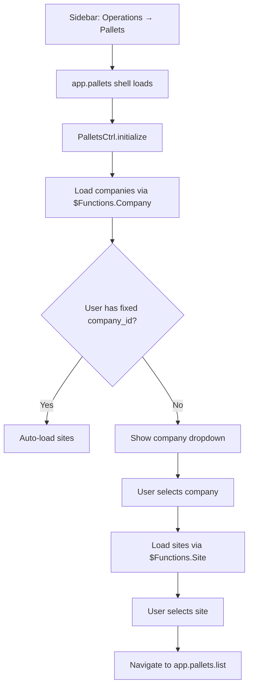
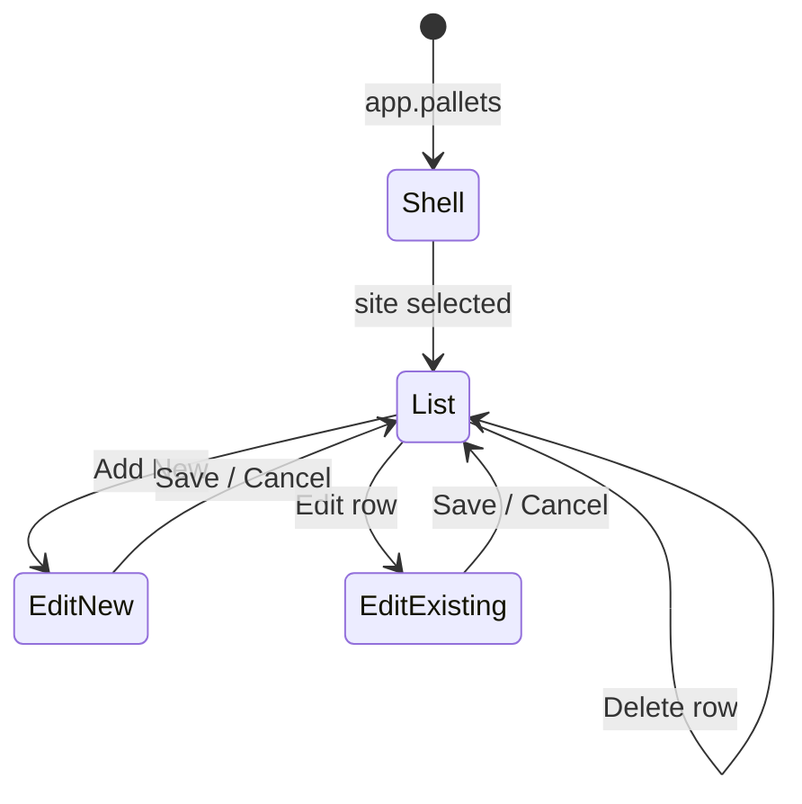

# User Journey — Pallets Module

**Task 3 deliverable**  
**Feature studied:** Pallets (Operations → Pallets)  
**Why this feature:** Closest existing pattern to Certificate Drafts — nested UI Router module, company/site filtering, CRUD via Restangular  
**Last updated:** June 2026

---

## 1. Feature summary

**Pallets** lets site staff define pallet types and weight amounts used during weighing operations. A pallet record belongs to a **company** and **site**. Users filter by company and site, then list, create, edit, or delete pallets for that site.

Certificate Drafts will follow the same journey shape: pick company/site → list records → add/edit form → save via API.

---

## 2. Personas

| Persona | Goal |
|---------|------|
| Site manager | Maintain pallet definitions for their site |
| Operator | (Indirect) Uses pallet data during weighing — does not manage pallets |

Access is via sidebar: **Operations → Pallets**. No separate permission flag — menu item is always visible under Operations (unlike Setup items which check `permissions.*`).

---

## 3. User journey (step by step)

### Step 1 — Open Pallets

| | |
|---|---|
| **User action** | Clicks **Operations → Pallets** in the sidebar |
| **Route** | `app.pallets` → `/app/pallets` |
| **Controller** | `PalletsCtrl as System` |
| **Template** | `app/tpls/pallet/pallet.html` |
| **System does** | `$navigation.clear()`, loads user via `$Functions.Users()`, loads company list |

---

### Step 2 — Select company and site

| | |
|---|---|
| **User action** | Chooses company (if not fixed) and site from dropdowns |
| **Controller logic** | `changeFilter('company')` or `changeFilter('site')` |
| **Navigation helper** | `$navigation.Company(id)` and `$navigation.Site(id)` store selection in session |
| **On site selected** | `$state.go('app.pallets.list', { id: site_id })` |

The shell template (`pallet.html`) shows:
- Company dropdown (hidden if user is locked to one company)
- Site dropdown (shown when company is selected)
- **Add New** button (shown when site is selected)

---

### Step 3 — View pallet list

| | |
|---|---|
| **Route** | `app.pallets.list` → `/app/pallets/list/:id` |
| **Controller** | `PalletListCtrl as System` |
| **Template** | `app/tpls/pallet/list.html` |
| **API call** | `$Functions.Pallets()` → `Restangular.all('pallets').getList($navigation.get())` |
| **Loading** | `$rootScope.Start()` → `$rootScope.Loaded()` |

**List columns:** Pallet Name, Amount in KG, Actions

**Row actions:**
| Button | Condition | Action |
|--------|-----------|--------|
| Edit | `!has_transaction` | `$state.go('app.pallets.edit', { pallet_id })` |
| Delete | `!has_transaction` | Confirm → `Restangular.one('pallets', id).remove()` |
| View Transaction | `has_transaction` | Navigate to transactions (read-only if linked) |

**Empty state:** If no site id in route params, `vm.palletList = []` — table renders empty.

---

### Step 4 — Add new pallet

| | |
|---|---|
| **User action** | Clicks **Add New** |
| **Route** | `app.pallets.edit` → `/app/pallets/edit/:pallet_id` (pallet_id is null) |
| **Controller** | `PalletEditCtrl as System` |
| **Template** | `app/tpls/pallet/edit.html` |

**Form fields:**
- Pallet Name (`ng-model="System.palletInfo.pallet_name"`) — required
- Amount in KG (`ng-model="System.palletInfo.amount"`) — required

**Validation:** `isPalletFormValid()` checks non-empty name and amount before submit.

---

### Step 5 — Save pallet (create)

| | |
|---|---|
| **User action** | Clicks **Save** |
| **Loading** | `$rootScope.Start()` |
| **API** | `Restangular.all('pallets').post(vm.palletInfo)` |
| **Payload includes** | `company_id`, `site_id` from `$rootScope.Params` |
| **On success** | `goToPalletList()` — returns to list state |
| **On error** | `$rootScope.Error(response)` |

---

### Step 6 — Edit existing pallet

| | |
|---|---|
| **User action** | Clicks **Edit** on a list row |
| **Route** | `app.pallets.edit` with `pallet_id` set |
| **Load** | `Restangular.one('pallets', pallet_id).get()` |
| **Save** | `Restangular.one('pallets', id).customPUT(vm.palletInfo)` |

---

### Step 7 — Delete pallet

| | |
|---|---|
| **User action** | Clicks **Delete**, confirms dialog |
| **API** | `Restangular.one('pallets', id).remove()` |
| **On success** | `vm.loadPallets()` refreshes list |
| **Blocked when** | `has_transaction` is true — Edit/Delete hidden |

---

## 4. Backend journey (same feature)

| Step | Endpoint | Controller method |
|------|----------|-------------------|
| List | `GET /api/pallets?company_id=&site_id=` | `PalletController::index()` |
| Get one | `GET /api/pallets/{id}` | `PalletController::show()` |
| Create | `POST /api/pallets` | `PalletController::store()` |
| Update | `PUT /api/pallets/{id}` | `PalletController::update()` |
| Delete | `DELETE /api/pallets/{id}` | `PalletController::destroy()` |

All methods require JWT auth via `JwtAuthController`. List filters by `company_id` and `site_id` query parameters.

---

## 5. UI states diagram

---

## 6. Patterns to copy for Certificate Drafts

| Pallets pattern | Certificate Drafts equivalent |
|-----------------|-------------------------------|
| `app.pallets` shell with company/site pickers | `app.certificate-drafts` shell |
| `app.pallets.list` child state | `app.certificate-drafts.list` |
| `app.pallets.edit` child state | `app.certificate-drafts.edit` (wizard) |
| `PalletsCtrl` / `PalletListCtrl` / `PalletEditCtrl` | `CertificateDraftsCtrl` / `ListCtrl` / `EditCtrl` |
| `$Functions.Pallets()` | `$Functions.CertificateDrafts()` |
| `Restangular.all('pallets')` | `Restangular.all('certificate-drafts')` |
| `ng-repeat` in DataTable list | Same for draft list |
| `ng-model` form fields | Wizard steps with `ng-model` |
| `$rootScope.Start/Loaded/Error` | Identical |
| Company/site via `$navigation` | Same scoping |

---

## 7. Differences Certificate Drafts will add

| Aspect | Pallets | Certificate Drafts |
|--------|---------|---------------------|
| Form | Single page, 2 fields | 4-step wizard |
| Child data | None | Multiple readings per draft |
| Calculations | None | Uncertainty helper |
| Auto-save | No | Yes (30s debounce) |
| Status | Implicit (exists/deleted) | `draft` / `in_review` / `submitted` |
| Role gating | Transaction lock only | Admin-only submit/delete |
| Permission flag | None (always in menu) | New `certificate_drafts` on usertypes |

---

## 8. Key source files

### Frontend

| File | Role |
|------|------|
| `app/js/routes.js` (lines ~561–583) | State definitions |
| `app/js/controllers/pallet/pallets.controller.js` | Shell controller |
| `app/js/controllers/pallet/list.controller.js` | List controller |
| `app/js/controllers/pallet/edit.controller.js` | Edit/create controller |
| `app/tpls/pallet/pallet.html` | Shell template |
| `app/tpls/pallet/list.html` | List table |
| `app/tpls/pallet/edit.html` | Form |
| `app/js/factory.js` → `$Functions.Pallets()` | API list helper |

### Backend

| File | Role |
|------|------|
| `app/Http/Controllers/PalletController.php` | CRUD logic |
| `app/Models/Pallet.php` | Eloquent model |
| `routes/api.php` | `Route::resource('pallets', ...)` |

---

## 9. Pain points observed (useful for Task 25 / 39)

| Issue | Detail |
|-------|--------|
| Misnamed delete function | `deleteWeighbridge()` in list controller — copy-paste name, still works |
| Console.log left in code | Debug logs in list and shell controllers |
| Empty list without site | No user-facing "select a site" message — just empty table |
| `has_transaction` lock | Good pattern — Certificate Drafts should lock submitted drafts similarly |

---

## Related documents

| Document | Content |
|----------|---------|
| `docs/05-certificate-drafts-spec.md` | Certificate Drafts requirements |
| `docs/00-architecture-plan.md` | Module architecture |
| `Weighsoft.ui.v1/docs/02-ROUTES-STATES.md` | UI Router reference |
