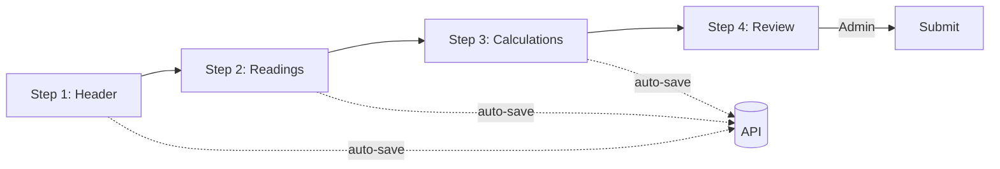

# Certificate Drafts — Technical Specification

**Feature:** Certificate Drafts for weighbridge calibration  
**System:** Weighsoft v1  
**Document version:** 1.0  
**Last updated:** June 2026  
**Status:** Draft — pending mentor interview (Task 4) confirmation of field list

---

## 1. Overview

### 1.1 Problem Statement

Weighbridges in Weighsoft are configured (`weighbridges` table) and used for live weighing, but there is no way to record calibration test data, calculate measurement uncertainty, or manage certificate paperwork. Technicians currently work outside the system.

### 1.2 Solution

Add a **Certificate Drafts** module that allows authorised users to:

1. Create a draft calibration certificate for a weighbridge  
2. Enter multiple test readings across a multi-step wizard  
3. Auto-save progress while editing  
4. Calculate uncertainty metrics from supplied formulas  
5. Review a results summary  
6. Submit the draft (admin only) for record-keeping  

### 1.3 Users and Roles

| Persona | Permissions | Actions |
|---------|-------------|---------|
| Calibration technician | `certificate_drafts = true` | Create, edit, auto-save own drafts |
| Company admin | `certificate_drafts = true` + `role_id` 1 or 2 | All technician actions + submit, delete any company draft |
| Weighbridge operator | `certificate_drafts = false` | No access to module |
| System admin | All permissions | Full access across companies |

Membership is determined by `users.company_id` (and optional `site_id`). No separate memberships table exists.

---

## 2. User Stories

### US-01 — List drafts
**As a** technician, **I want to** see all certificate drafts for my company/site **so that** I can continue incomplete work.

**Acceptance criteria:**
- List shows certificate number, weighbridge, status, calibration date, last saved time  
- Empty state message when no drafts exist  
- Loading overlay during fetch  
- Error toast on API failure  

### US-02 — Create draft
**As a** technician, **I want to** start a new certificate draft **so that** I can record calibration data.

**Acceptance criteria:**
- Wizard step 1 captures header fields (weighbridge, date, technician, capacity)  
- Draft saved with `status = draft` on first save  
- Certificate number auto-generated as `{company.code}-CAL-{YYYY}-{seq}`  

### US-03 — Enter readings
**As a** technician, **I want to** enter at least 3 test readings **so that** uncertainty can be calculated.

**Acceptance criteria:**
- Applied load and indicated value are required numeric fields  
- Error value auto-calculated as `indicated_value - applied_load`  
- Validation rejects non-numeric and out-of-range values  

### US-04 — Auto-save
**As a** technician, **I want** my draft to save automatically **so that** I do not lose work.

**Acceptance criteria:**
- Auto-save triggers every 30 seconds while editing and on step navigation  
- `last_saved_at` updates on server  
- "Last saved at …" indicator visible in wizard header  

### US-05 — View calculations
**As a** technician, **I want to** see uncertainty results **so that** I can verify the weighbridge conforms.

**Acceptance criteria:**
- Summary shows mean error, repeatability, combined uncertainty, expanded uncertainty  
- Conformity flag shown (pass/fail against capacity tolerance)  
- Calculations match fixture test cases  

### US-06 — Submit draft (admin)
**As a** company admin, **I want to** submit a completed draft **so that** it becomes a formal record.

**Acceptance criteria:**
- Submit button visible only to admin roles  
- Status changes from `draft` or `in_review` to `submitted`  
- `submitted_at` timestamp recorded  
- Submitted drafts are read-only  

---

## 3. Functional Requirements

| ID | Requirement | Priority |
|----|-------------|----------|
| FR-01 | CRUD API for certificate drafts scoped by company | Must |
| FR-02 | Nested readings stored per draft (1:N) | Must |
| FR-03 | Multi-step wizard (4 steps) with progress indicator | Must |
| FR-04 | Client + server validation | Must |
| FR-05 | Auto-save with debounce | Must |
| FR-06 | Uncertainty calculation service | Must |
| FR-07 | Results summary screen | Must |
| FR-08 | Role-based UI (admin submit/delete) | Must |
| FR-09 | Soft delete for drafts | Must |
| FR-10 | Seed data for demo | Should |
| FR-11 | Company certificate prefix setting | Could (Task 6) |
| FR-12 | Export PDF certificate | Won't (future) |

---

## 4. Wizard Flow



### Step 1 — Header
- Weighbridge (dropdown from `$Functions.Weighbridges()`)
- Calibration date
- Technician name (default: logged-in user name)
- Capacity + unit (default from site `measure_type`)
- Resolution (kg per division)
- Repeatability test count

### Step 2 — Readings
- Dynamic table with `ng-repeat` over `vm.readings`
- Columns: Sequence, Applied Load, Indicated Value, Error (computed), Repeatability
- Add row / remove row buttons
- Minimum 3 readings enforced

### Step 3 — Calculations
- Read-only summary populated by `uncertaintyCalculator.js`
- "Recalculate" button re-runs helper
- Stores results on draft: `combined_uncertainty`, `expanded_uncertainty`, `conforms`

### Step 4 — Review
- Full draft summary
- Status badge
- Submit button (admin `ng-if`)
- Back to edit / Cancel

---

## 5. Data Model (MySQL — Primary Implementation)

### 5.1 Table: `certificate_drafts`

```sql
CREATE TABLE certificate_drafts (
    id BIGINT UNSIGNED AUTO_INCREMENT PRIMARY KEY,
    company_id BIGINT UNSIGNED NOT NULL,
    site_id BIGINT UNSIGNED NOT NULL,
    weighbridge_id BIGINT UNSIGNED NOT NULL,
    created_by BIGINT UNSIGNED NOT NULL,
    certificate_number VARCHAR(50) NOT NULL,
    status ENUM('draft', 'in_review', 'submitted', 'cancelled') DEFAULT 'draft',
    calibration_date DATE NOT NULL,
    technician_name VARCHAR(255) NOT NULL,
    capacity DECIMAL(12, 3) NOT NULL,
    capacity_unit VARCHAR(10) NOT NULL DEFAULT 'kg',
    resolution DECIMAL(10, 3) NOT NULL,
    repeatability_count INT DEFAULT 3,
    combined_uncertainty DECIMAL(12, 4) NULL,
    expanded_uncertainty DECIMAL(12, 4) NULL,
    coverage_factor INT DEFAULT 2,
    conforms BOOLEAN NULL,
    metadata JSON NULL,
    last_saved_at TIMESTAMP NULL,
    submitted_at TIMESTAMP NULL,
    created_at TIMESTAMP NULL,
    updated_at TIMESTAMP NULL,
    deleted_at TIMESTAMP NULL,
    FOREIGN KEY (company_id) REFERENCES companies(id),
    FOREIGN KEY (site_id) REFERENCES sites(id),
    FOREIGN KEY (weighbridge_id) REFERENCES weighbridges(id),
    FOREIGN KEY (created_by) REFERENCES users(id),
    INDEX idx_company_status (company_id, status),
    UNIQUE KEY uk_certificate_number (company_id, certificate_number)
);
```

### 5.2 Table: `certificate_readings`

```sql
CREATE TABLE certificate_readings (
    id BIGINT UNSIGNED AUTO_INCREMENT PRIMARY KEY,
    certificate_draft_id BIGINT UNSIGNED NOT NULL,
    sequence INT NOT NULL,
    applied_load DECIMAL(12, 3) NOT NULL,
    indicated_value DECIMAL(12, 3) NOT NULL,
    error_value DECIMAL(12, 3) NOT NULL,
    repeatability_value DECIMAL(12, 3) NULL,
    created_at TIMESTAMP NULL,
    updated_at TIMESTAMP NULL,
    FOREIGN KEY (certificate_draft_id) REFERENCES certificate_drafts(id) ON DELETE CASCADE,
    INDEX idx_draft_sequence (certificate_draft_id, sequence)
);
```

### 5.3 Eloquent Relationships

```php
// CertificateDraft
public function readings() { return $this->hasMany(CertificateReading::class); }
public function company()   { return $this->belongsTo(Company::class); }
public function weighbridge(){ return $this->belongsTo(Weighbridge::class); }
public function creator()   { return $this->belongsTo(User::class, 'created_by'); }

// CertificateReading
public function draft() { return $this->belongsTo(CertificateDraft::class, 'certificate_draft_id'); }
```

---

## 6. PouchDB Document Schema (Future Sync — Task 8)

> **Note:** Designed for future offline use. Implemented as MySQL tables during this placement.

### 6.1 Document: `certificate_draft`

```json
{
  "_id": "certificate_draft:42",
  "_rev": "1-abc123",
  "type": "certificate_draft",
  "company_id": 1,
  "site_id": 2,
  "weighbridge_id": 5,
  "created_by": 7,
  "certificate_number": "DEMO-CAL-2026-001",
  "status": "draft",
  "calibration_date": "2026-06-05",
  "technician_name": "V. Julius",
  "capacity": 60000,
  "capacity_unit": "kg",
  "resolution": 20,
  "repeatability_count": 3,
  "combined_uncertainty": null,
  "expanded_uncertainty": null,
  "coverage_factor": 2,
  "conforms": null,
  "last_saved_at": "2026-06-05T14:30:00.000Z",
  "submitted_at": null,
  "readings": [
    {
      "_id": "certificate_reading:101",
      "sequence": 1,
      "applied_load": 10000,
      "indicated_value": 10020,
      "error_value": 20,
      "repeatability_value": 10
    }
  ],
  "created_at": "2026-06-05T10:00:00.000Z",
  "updated_at": "2026-06-05T14:30:00.000Z"
}
```

### 6.2 Design Rules

| Rule | Description |
|------|-------------|
| `_id` prefix | `certificate_draft:` and `certificate_reading:` for type filtering |
| Embedded readings | Denormalised in draft doc for offline reads; also stored as child docs |
| `_rev` | Used for conflict resolution on sync |
| `type` field | PouchDB find() index key |
| MySQL mapping | 1:1 field names between PouchDB doc and MySQL columns |

---

## 7. Validation Schemas (Zod-Style — Task 9)

File: `app/js/validation/certificateDraft.schema.js`

```javascript
/**
 * Zod-style validation objects for Certificate Drafts.
 * Adapted for AngularJS — no Zod runtime dependency.
 */
var CertificateDraftSchema = {
  step1: {
    weighbridge_id: { required: true, type: 'number', message: 'Weighbridge is required.' },
    calibration_date: { required: true, type: 'date', message: 'Calibration date is required.' },
    technician_name: { required: true, minLength: 2, maxLength: 255, message: 'Technician name is required.' },
    capacity: { required: true, type: 'number', min: 1, max: 200000, message: 'Capacity must be between 1 and 200,000.' },
    capacity_unit: { required: true, enum: ['kg', 't', 'lbs'], message: 'Unit must be kg, t, or lbs.' },
    resolution: { required: true, type: 'number', min: 0.1, message: 'Resolution must be a positive number.' },
    repeatability_count: { required: true, type: 'number', min: 3, max: 10, message: 'At least 3 repeatability readings required.' }
  },

  reading: {
    applied_load: { required: true, type: 'number', min: 0, message: 'Applied load must be a non-negative number.' },
    indicated_value: { required: true, type: 'number', min: 0, message: 'Indicated value must be a non-negative number.' },
    repeatability_value: { required: false, type: 'number', min: 0, message: 'Repeatability must be non-negative.' }
  },

  step2: {
    readings: {
      required: true,
      minItems: 3,
      maxItems: 20,
      message: 'At least 3 calibration readings are required.'
    }
  },

  validate: function (step, data) {
    var errors = [];
    var rules = this[step];
    if (!rules) return errors;
    // ... iterate rules, push { field, message } objects
    return errors;
  }
};
```

### Server-side validation (Laravel)

```php
$rules = [
    'weighbridge_id'    => 'required|integer|exists:weighbridges,id',
    'calibration_date'  => 'required|date',
    'technician_name'   => 'required|string|max:255',
    'capacity'          => 'required|numeric|min:1|max:200000',
    'capacity_unit'     => 'required|in:kg,t,lbs',
    'resolution'        => 'required|numeric|min:0.1',
    'readings'          => 'required|array|min:3|max:20',
    'readings.*.applied_load'    => 'required|numeric|min:0',
    'readings.*.indicated_value' => 'required|numeric|min:0',
];
```

---

## 8. Uncertainty Calculations (Tasks 31–32)

### 8.1 Formulas

> **Source:** Confirmed in `docs/04-mentor-interview-notes.md` §4 (student decision, June 2026).  
> Mentor may revise tolerance rule or standard reference later.

| Symbol | Formula | Description |
|--------|---------|-------------|
| `e_i` | `indicated_value - applied_load` | Error per reading |
| `ē` | `mean(e_i)` | Mean error |
| `s_r` | `stdDev(repeatability_values)` | Repeatability standard deviation |
| `u_rep` | `s_r / sqrt(n)` | Repeatability uncertainty |
| `u_res` | `resolution / (2 * sqrt(3))` | Resolution uncertainty (rectangular distribution) |
| `u_c` | `sqrt(u_rep² + u_res²)` | Combined standard uncertainty |
| `U` | `k * u_c` | Expanded uncertainty (k = coverage factor, default 2) |
| Conforms | `U <= resolution` | Pass when expanded uncertainty is within one scale division |

### 8.2 JavaScript Helper

File: `app/js/helpers/uncertaintyCalculator.js`

```javascript
function calculateUncertainty(readings, resolution, coverageFactor) {
  var errors = readings.map(function (r) {
    return r.indicated_value - r.applied_load;
  });
  var meanError = errors.reduce(function (a, b) { return a + b; }, 0) / errors.length;
  var repValues = readings.map(function (r) { return r.repeatability_value || 0; });
  var u_rep = standardDeviation(repValues) / Math.sqrt(repValues.length);
  var u_res = resolution / (2 * Math.sqrt(3));
  var u_c = Math.sqrt(u_rep * u_rep + u_res * u_res);
  var U = coverageFactor * u_c;
  return { meanError: meanError, u_rep: u_rep, u_res: u_res, u_c: u_c, U: U };
}
```

### 8.3 Test Fixtures (Task 32)

File: `tests/fixtures/certificateCalculations.json`

```json
[
  {
    "name": "three_readings_standard",
    "resolution": 20,
    "coverage_factor": 2,
    "readings": [
      { "applied_load": 10000, "indicated_value": 10020, "repeatability_value": 10 },
      { "applied_load": 20000, "indicated_value": 20015, "repeatability_value": 12 },
      { "applied_load": 30000, "indicated_value": 30025, "repeatability_value": 8 }
    ],
    "expected": { "u_c": 5.8878, "U": 11.7756, "conforms": true }
  }
]
```

---

## 9. Repository Class (Tasks 10–11)

File: `app/js/repositories/CertificateDraftRepository.js`

```javascript
angular.module('xenon.factory').factory('CertificateDraftRepository',
  function (Restangular, $q) {
    var base = Restangular.all('certificate-drafts');

    return {
      list: function (params) {
        return base.getList(params);
      },
      get: function (id) {
        return Restangular.one('certificate-drafts', id).get();
      },
      create: function (data) {
        return base.post(data);
      },
      update: function (id, data) {
        return Restangular.one('certificate-drafts', id).customPUT(data);
      },
      remove: function (id) {
        return Restangular.one('certificate-drafts', id).remove();
      },
      autosave: function (id, data) {
        data.last_saved_at = new Date().toISOString();
        return Restangular.one('certificate-drafts', id).customPUT(data);
      },
      submit: function (id) {
        return Restangular.one('certificate-drafts', id).post('submit', {});
      }
    };
  }
);
```

---

## 10. UI Specification

### 10.1 List Screen Wireframe (Task 13)

```
┌─────────────────────────────────────────────────────────┐
│ Certificate Drafts                    [+ New Draft]   │
├──────────┬────────────┬──────────┬──────────┬───────────┤
│ Cert No  │ Weighbridge│ Status   │ Date     │ Actions   │
├──────────┼────────────┼──────────┼──────────┼───────────┤
│ DEMO-001 │ WB-01      │ [draft]  │ 05/06/26 │ Edit Del  │
│ DEMO-002 │ WB-02      │ [submitted]│ 01/06/26│ View     │
├──────────┴────────────┴──────────┴──────────┴───────────┤
│ Loading spinner / "No drafts found" / Error message    │
└─────────────────────────────────────────────────────────┘
```

Implementation: `ng-repeat` in Bootstrap table (same pattern as `app/tpls/pallet/list.html`).

### 10.2 Reusable Components (Task 21)

**StatusBadge directive:**
```html
<span class="label" ng-class="{
  'label-default': status === 'draft',
  'label-warning': status === 'in_review',
  'label-success': status === 'submitted',
  'label-danger': status === 'cancelled'
}">{{ status }}</span>
```

**FormSection directive:** Wraps `<fieldset><legend>` for consistent wizard sections.

### 10.3 Role-Based Visibility (Task 20)

```html
<button ng-if="System.isAdmin" ng-click="System.submitDraft()">Submit</button>
<button ng-if="System.isAdmin" ng-click="System.deleteDraft(draft)">Delete</button>
```

`System.isAdmin` set from `$rootScope.User.role_id <= 2` or `permissions.certificate_drafts_admin`.

---

## 11. Auto-Save Design (Task 29)

| Trigger | Debounce | Action |
|---------|----------|--------|
| Field change | 30 seconds | `CertificateDraftRepository.autosave(id, vm.draft)` |
| Step navigation | Immediate | Save before advancing step |
| Browser `beforeunload` | Immediate | Best-effort save if dirty flag set |

Dirty flag: `vm.isDirty = true` on `ng-change`; cleared after successful save.

Display: `Last saved: {{ vm.draft.last_saved_at | date:'medium' }}` in wizard header.

---

## 12. Error Handling (Task 34)

| Scenario | Backend response | Frontend handling |
|----------|------------------|-------------------|
| Validation failure | 422 + `{ field: [messages] }` | Show field errors; `$rootScope.Error(response)` |
| Not found | 404 | Toast + redirect to list |
| Unauthorised submit | 403 | Toast "Admin permission required" |
| Server error | 500 | `$rootScope.Error(response)`; keep local draft intact |
| Network failure | — | Toast; retain `vm.isDirty`; retry on next auto-save |

---

## 13. Seed Data (Task 12)

`CertificateDraftSeeder` creates:

| Entity | Data |
|--------|------|
| Company | `DEMO` — "Demo Calibration Co" |
| Site | `DEMO-SITE` linked to company |
| Weighbridge | `WB-DEMO-01` |
| User | `tech@demo.local` — technician role with `certificate_drafts = true` |
| User | `admin@demo.local` — admin role |
| Draft 1 | Status `draft`, 3 readings, no calculations |
| Draft 2 | Status `submitted`, 5 readings, full calculations |

---

## 14. Company Admin Improvement (Task 6 — Related Spec)

| ID | Improvement | Details |
|----|-------------|---------|
| CA-01 | Certificate prefix per company | Optional `certificate_prefix` field on company form |
| CA-02 | Draft count on dashboard | Card: "X drafts pending review" |
| CA-03 | User membership display | Show company + site on user list for admin clarity |
| CA-04 | Bulk permission toggle | Enable `certificate_drafts` on a user type from usertype screen |

Detailed spec: `docs/06-company-admin-improvement.md` (to be written in Phase A).

---

## 15. QA Checklist Outline (Task 28)

- [ ] Login as technician — Certificate Drafts menu visible  
- [ ] Login as operator — menu hidden  
- [ ] Create draft — saves with status `draft`  
- [ ] Enter 2 readings — validation blocks advance  
- [ ] Enter 3 readings — step 3 calculations populate  
- [ ] Auto-save — `last_saved_at` updates within 30s  
- [ ] Refresh browser — draft data restored  
- [ ] Login as admin — Submit changes status to `submitted`  
- [ ] Technician cannot see Submit button  
- [ ] Delete draft — soft deleted, removed from list  
- [ ] Company isolation — user A cannot see company B drafts  
- [ ] Calculation fixtures — PHPUnit tests pass  

Full checklist: `docs/07-qa-testing/CERTIFICATE-DRAFTS-QA.md`

---

## 16. Demo Script Outline (Task 37)

1. Login as `admin@demo.local`  
2. Navigate to Setup → Certificate Drafts  
3. Open existing draft `DEMO-CAL-2026-001`  
4. Show wizard steps and auto-save indicator  
5. Add a reading; show validation on invalid input  
6. Advance to calculations — show uncertainty summary  
7. Submit draft — status changes to `submitted`  
8. Return to list — confirm read-only state  

---

## 17. Privacy / Confidentiality (Task 35)

| Item | Handling |
|------|----------|
| Company calibration data | Scoped by `company_id`; never exposed cross-tenant |
| User credentials | Not stored in draft `metadata` |
| Student commit access | No production credentials in repo |
| Demo seed data | Fictional company names only |
| Client logos / addresses | Do not copy real client data into seed files |

---

## 18. Implementation Checklist

### Backend (8 steps)

- [ ] Migration: `certificate_drafts`  
- [ ] Migration: `certificate_readings`  
- [ ] Models: `CertificateDraft`, `CertificateReading`  
- [ ] Controller: `CertificateDraftController`  
- [ ] Route: `Route::resource('certificate-drafts', ...)` + submit action  
- [ ] Service: `CertificateDraftService` (calculations)  
- [ ] Seeder: `CertificateDraftSeeder`  
- [ ] Tests: service unit + controller feature tests  

### Frontend (5 steps)

- [ ] UI Router states in `routes.js`  
- [ ] Shell + list controllers and templates  
- [ ] Edit/wizard controller and step templates  
- [ ] `CertificateDraftRepository` + validation schema + `$Functions.CertificateDrafts()`  
- [ ] Menu entry + `usertypes.certificate_drafts` permission  

---

## 19. Resolved decisions (June 2026)

_Mentor interview deferred. Answers confirmed in `docs/04-mentor-interview-notes.md` §4._

| # | Question | Decision |
|---|----------|----------|
| 1 | Uncertainty formulas and tolerance? | GUM-style formulas in §8.1; `conforms` when `U <= resolution` |
| 2 | Readings per certificate? | Minimum 3, maximum 20 |
| 3 | Manager `in_review` before submit? | **No** for MVP — `draft` → `submitted` via admin |
| 4 | Certificate number format? | `{prefix}-CAL-{YYYY}-{seq}` auto-generated |
| 5 | PDF on submit? | **Out of scope** for MVP |
| 6 | Default `certificate_drafts` permission? | Calibration Technician usertype in seeder; admins submit |

---

## 20. References

| Resource | Path |
|----------|------|
| Project plan | `docs/00-project-plan.md` |
| Architecture plan | `docs/00-architecture-plan.md` |
| Pallet module (pattern) | `Weighsoft.ui.v1/app/js/controllers/pallet/` |
| Pallet API (pattern) | `Weighsoft.back.v1/app/Http/Controllers/PalletController.php` |
| Data model docs | `Weighsoft.back.v1/docs/02-architecture/06-DATA-MODEL.md` |
| User roles | `Weighsoft.back.v1/docs/03-user-guide/01-USER-ROLES.md` |
| Business validation | `Weighsoft.back.v1/docs/04-developer-guide/10-BUSINESS-RULES-VALIDATION.md` |
