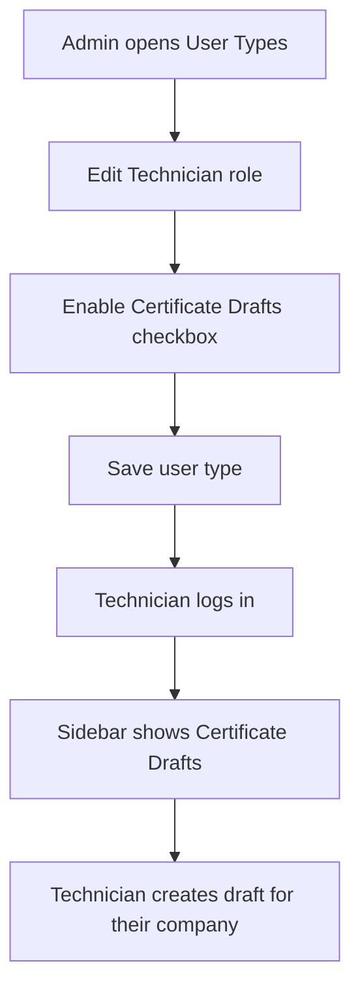

# Company Admin Improvement — Requirements Specification

**Task 6 deliverable**  
**Scope:** Improvements to company administration supporting Certificate Drafts  
**Last updated:** June 2026

---

## 1. Overview

### 1.1 Problem

The existing **Company Management** screen (`app.company`) handles core company CRUD — code, registered name, addresses, VAT, logo. It does not expose settings needed for calibration certificate workflows, and admin visibility into user–company relationships is limited.

As Certificate Drafts is added, company admins need:

- A way to configure certificate numbering per company
- Visibility into pending calibration work
- Clearer understanding of which users belong to which company/site

### 1.2 Current implementation

| Layer | File | What it does today |
|-------|------|-------------------|
| Route | `app.company` in `routes.js` | `/app/company` |
| Controller | `CompaniesCtrl as System` in `companies.js` | List, add, edit, delete companies |
| Template | `app/tpls/companies/list.html` | Inline add/edit form + company table |
| API | `CompanyController.php` | CRUD + `show()` returns sites and users |
| Permission | `permissions.companies === "true"` | Menu visibility in `services.js` |

**Existing `show()` enrichment** (already useful):

```php
// CompanyController::show() already returns:
$company->site   // sites with workstations
$company->user   // users belonging to company
```

---

## 2. User stories

### US-CA-01 — Certificate prefix
**As a** company admin, **I want to** set a certificate number prefix for my company **so that** auto-generated draft numbers are identifiable.

**Acceptance criteria:**
- Optional `certificate_prefix` field on company create/edit form
- Defaults to company `code` if blank
- Used when generating `{prefix}-CAL-{YYYY}-{seq}`

### US-CA-02 — Pending drafts visibility
**As a** company admin, **I want to** see how many certificate drafts are pending **so that** I know what calibration work is outstanding.

**Acceptance criteria:**
- Dashboard card or company detail section shows count by status (`draft`, `in_review`)
- Count scoped to admin's company
- Links to Certificate Drafts list filtered by status

### US-CA-03 — User membership clarity
**As a** company admin, **I want to** see which company and site each user belongs to **so that** I can manage access correctly.

**Acceptance criteria:**
- User list shows company name and site name columns (not just IDs)
- Company detail view lists assigned users with role name

### US-CA-04 — Certificate permission on user type
**As a** system admin, **I want to** enable Certificate Drafts access per user type **so that** only calibration staff see the module.

**Acceptance criteria:**
- New `certificate_drafts` column on `usertypes` table (`"true"` / `"false"`)
- Checkbox on User Types edit screen
- Sidebar shows **Certificate Drafts** only when permission is true

---

## 3. Functional requirements

| ID | Requirement | Priority | Phase |
|----|-------------|----------|-------|
| CA-FR-01 | Add `certificate_prefix` to `companies` table | Should | B |
| CA-FR-02 | Show `certificate_prefix` on company form | Should | C |
| CA-FR-03 | Use prefix in certificate number generation | Must | B |
| CA-FR-04 | Add `certificate_drafts` permission to `usertypes` | Must | B |
| CA-FR-05 | User Types UI checkbox for `certificate_drafts` | Must | C |
| CA-FR-06 | Dashboard pending-drafts count card | Could | D |
| CA-FR-07 | User list — show company + site names | Could | C |
| CA-FR-08 | Company detail — show linked users with roles | Could | D |

---

## 4. Data model changes

### 4.1 `companies` table — new column

```sql
ALTER TABLE companies
ADD COLUMN certificate_prefix VARCHAR(20) NULL AFTER code;
```

| Column | Type | Default | Notes |
|--------|------|---------|-------|
| `certificate_prefix` | VARCHAR(20) NULL | NULL | Falls back to `code` when generating cert numbers |

### 4.2 `usertypes` table — new column

```sql
ALTER TABLE usertypes
ADD COLUMN certificate_drafts VARCHAR(10) DEFAULT 'false' AFTER xero;
```

| Column | Type | Default | Notes |
|--------|------|---------|-------|
| `certificate_drafts` | VARCHAR(10) | `'false'` | Matches existing permission flag pattern |

---

## 5. UI changes

### 5.1 Company form (`companies/list.html`)

Add field inside Company Information fieldset:

```html
<div class="form-group">
  <label for="certificate_prefix">Certificate Prefix</label>
  <input type="text" id="certificate_prefix"
         ng-model="System.companyInfo.certificate_prefix"
         class="form-control"
         placeholder="Defaults to company code if blank" />
</div>
```

### 5.2 User Types form (`usertypes/list.html`)

Add permission checkbox following existing pattern:

```html
<label>
  <input type="checkbox"
         ng-model="System.userTypeInfo.certificate_drafts"
         ng-true-value="'true'" ng-false-value="'false'" />
  Certificate Drafts
</label>
```

### 5.3 Sidebar menu (`services.js`)

Add under Operations (after Tares):

```javascript
if (permissions.certificate_drafts === "true") {
  vm.Operations.addItem("Certificate Drafts", "/app/certificate-drafts", "fa-certificate");
}
```

### 5.4 Dashboard card (Could — Phase D)

On `app.dashboard-main`, add a panel:

| Metric | Source |
|--------|--------|
| Drafts in progress | `GET /api/certificate-drafts?status=draft` count |
| Awaiting review | `GET /api/certificate-drafts?status=in_review` count |

---

## 6. API changes

### 6.1 CompanyController

| Method | Change |
|--------|--------|
| `store()` | Accept optional `certificate_prefix`; default empty string |
| `update()` | Accept optional `certificate_prefix` |
| `show()` | Return `certificate_prefix` in response (already included via model) |

### 6.2 UserTypeController

| Method | Change |
|--------|--------|
| `store()` / `update()` | Accept `certificate_drafts` flag |

### 6.3 New endpoint (dashboard — Could)

```
GET /api/certificate-drafts/summary?company_id=
```

Response:

```json
{
  "draft": 3,
  "in_review": 1,
  "submitted": 12
}
```

---

## 7. Certificate number generation

When creating a new draft:

```
prefix = company.certificate_prefix || company.code
year   = current year (YYYY)
seq    = count of drafts for company this year + 1, zero-padded to 3 digits

certificate_number = "{prefix}-CAL-{year}-{seq}"
-- Example: DEMO-CAL-2026-001
```

Implemented in `CertificateDraftController::store()` or `CertificateDraftService`.

---

## 8. User journey — admin enables Certificate Drafts



---

## 9. Acceptance criteria (summary)

- [x] Company form saves and loads `certificate_prefix`
- [x] New drafts use prefix in certificate number (`CertificateDraftService::generateCertificateNumber`)
- [x] User type with `certificate_drafts = false` does not see menu item (`services.js`)
- [x] User type with `certificate_drafts = true` sees menu item
- [x] User Types form exposes Certificate Drafts permission (`user_type.js`)
- [x] Admin can submit drafts; technician cannot (role_id 1–2)
- [ ] (Could) Dashboard shows pending draft count
- [ ] (Could) User list shows company/site names

---

## 10. Implementation order

| Step | Work | Tied to |
|------|------|---------|
| 1 | Migration: `certificate_prefix` on companies | Backend step 1 |
| 2 | Migration: `certificate_drafts` on usertypes | Backend step 1 |
| 3 | Update `CompanyController` validation/fillable | Backend step 4 |
| 4 | Company form field | Frontend step 3 |
| 5 | User Types checkbox | Frontend step 5 |
| 6 | Sidebar menu entry | Frontend step 5 |
| 7 | Dashboard card | Phase D (optional) |

---

## 11. Out of scope

| Item | Reason |
|------|--------|
| Multi-company user membership | Not supported — one `company_id` per user |
| Company-level approval workflows | Handled in Certificate Drafts status, not company admin |
| Billing / licensing per company | Not part of WIL scope |

---

## Related documents

| Document | Content |
|----------|---------|
| `docs/05-certificate-drafts-spec.md` | Main feature spec (§14 references this doc) |
| `docs/04-mentor-interview-notes.md` | Mentor confirmation for admin priorities |
| `docs/03-user-journey-pallets.md` | Module pattern reference |
| `Weighsoft.ui.v1/app/js/controllers/companies.js` | Current company controller |
| `Weighsoft.back.v1/app/Http/Controllers/CompanyController.php` | Current API |
